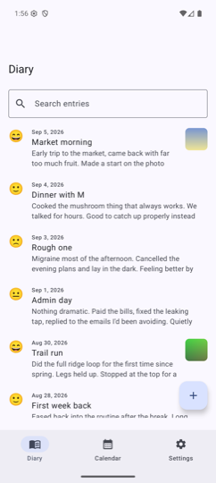
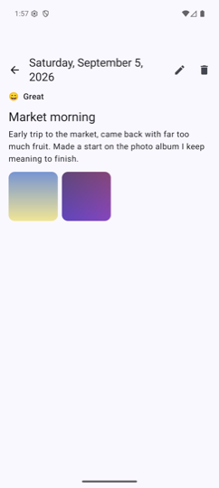
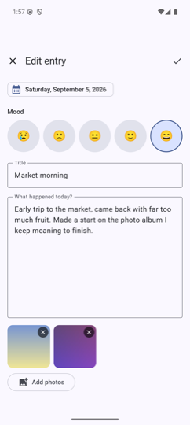
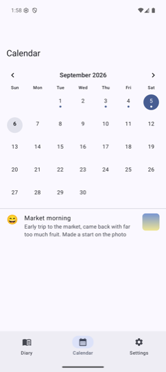
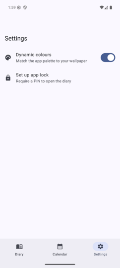
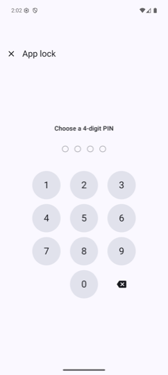

# Diary

A private, offline journalling app for Android. Write a dated entry each day, tag
how you felt, attach photos, and look back over past entries by search or on a
calendar. Everything stays on the device, behind an optional PIN / biometric lock.

> The Gradle module and package are spelled `dairy` — the app itself is a diary.

## Screenshots

<table>
  <tr>
    <td align="center"><br>Entries</td>
    <td align="center"><br>Entry</td>
    <td align="center"><br>Editor</td>
  </tr>
  <tr>
    <td align="center"><br>Calendar</td>
    <td align="center"><br>Settings</td>
    <td align="center"><br>App lock</td>
  </tr>
</table>

## Features

- **Entries** — create, edit and delete dated entries with a title and free-text body.
- **Mood** — tag each entry with one of five moods; the mood shows in the list and on the entry.
- **Photos** — attach images from the gallery (via the Android photo picker, no storage
  permission). Photos are copied into app-private storage and shown as thumbnails in the
  list, on the entry, and in the editor.
- **Search** — full-text search across entry titles and bodies.
- **Calendar** — a month grid marks the days that have entries; tap a day to read them.
- **App lock** — optional 4-digit PIN, stored only as a salted PBKDF2 hash. The app
  re-locks whenever it goes to the background.
- **Biometric unlock** — unlock with fingerprint / face once a PIN is set.
- **Privacy** — while a lock is set, `FLAG_SECURE` keeps diary content out of screenshots
  and the recent-apps preview. `allowBackup` is disabled.
- **Theme** — Material 3 with dynamic colour (Android 12+), toggleable in settings; follows
  the system light/dark setting.

## Tech stack

| Area | Choice |
|---|---|
| Language | Kotlin 2.2 |
| UI | Jetpack Compose, Material 3 |
| Navigation | Navigation Compose (type-safe routes via `kotlinx.serialization`) |
| Persistence | Room (KSP) |
| Preferences | Jetpack DataStore (Preferences) |
| Images | Coil 3 |
| Auth | AndroidX Biometric, PBKDF2 (`javax.crypto`) |
| Async | Kotlin coroutines + `Flow` / `StateFlow` |
| Min / target SDK | 26 / 37 |

## Architecture

Single-module app, MVVM with unidirectional data flow.

```
data/          Room entities, DAO, database, repository, photo + preference storage
security/      PIN hashing, PIN storage, background lock tracking, biometric prompt
di/            AppContainer — the manual dependency graph
ui/
  entries/     list, detail, editor screens + view models
  calendar/    month view screen + view model
  lock/        PIN pad, lock screen, PIN setup + view models
  settings/    settings screen + view model
  DairyApp.kt  NavHost, bottom navigation, lock gate
```

- **Dependency injection is manual.** `DiaryApplication` owns an `AppContainer` that lazily
  builds the database, repository, `PhotoStorage`, `PinManager`, `LockManager` and
  `AppPreferences`. View models pull what they need from it through a `CreationExtras`
  extension (`ui/ViewModelExt.kt`).
- **One `ViewModel` per screen**, exposing a single `StateFlow` of UI state; screens collect
  it with `collectAsStateWithLifecycle`.
- **The lock** is a gate in `DairyApp`: `LockManager` observes `ProcessLifecycleOwner` and
  flips `isLocked` to `true` on `ON_STOP` when a PIN exists; the composable shows
  `LockScreen` instead of the nav graph until unlocked.
- **Room schemas** are exported to `app/schemas/` for migration history.

## Building & running

Requires JDK 17+ and the Android SDK (compileSdk 37).

```bash
# debug APK
./gradlew assembleDebug

# install on a connected device / emulator
./gradlew installDebug
```

Open the project in Android Studio and run the `app` configuration for day-to-day work.

## Testing

```bash
# JVM unit tests — PIN hashing
./gradlew testDebugUnitTest

# instrumented tests — Room DAO (needs a device / emulator)
./gradlew connectedDebugAndroidTest
```

- `PinHasherTest` — PBKDF2 verify / reject / salt uniqueness.
- `DiaryDaoTest` — insert & observe, search, date-range queries, cascade delete of photos.

## Notes

- The project targets bleeding-edge AGP / Compose. Two workarounds live in
  `app/build.gradle.kts` and `gradle.properties`: `android.disallowKotlinSourceSets=false`
  (so KSP works with AGP's built-in Kotlin) and a `kotlin-stdlib` version force (Coil 3
  pulls a newer stdlib than the compiler reads).

## License

[MIT](LICENSE).
